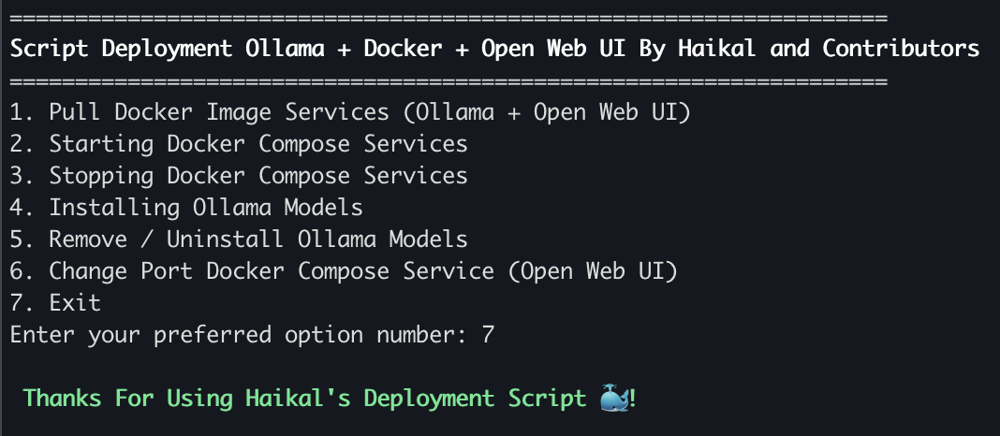
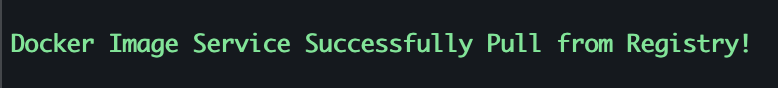
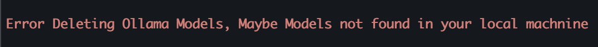

# Deploy Your Personal AI (Ollama + Docker + Open Web UI)

<p>This project is a simple script for those of you who want to create or have a Personal AI such as ChatGPT, DeepSeek, etc. Without requiring complicated configuration, you can easily set up your own AI system. Using Docker Compose, you just need to run a few commands, and with Reverse Proxy, you can make it accessible through your personal domain.
</p>

## Requirements

- Docker
- docker compose / docker-compose Command
- Bash Shell

## Features

- Simple Deployment using Docker Compose
- Interactive Bash Script for Unix Operating System Based
- Easy to Installing Available Models

## Manual Installation and Deployment

<p>1. Clone Project Repository</p>

```bash
git clone https://github.com/HaikalRFadhilahh/docker-ollama-open-wui.git docker-ollama-open-wui
```

<p>2. Go to Project Repository</p>

```bash
cd docker-ollama-open-wui
```

<p>3. Pull Docker Image Services</p>

```bash
docker compose pull
```

<p>4. Starting Docker Service via Docker Compose</p>

```bash
docker compose up -d
```

### Stopping Ollama and Open Web UI Services

<p>Stopping All Services (Without Remove Ollama Models)</p>

```bash
docker compose down
```

<p>Stopping All Service and Remove Volumes (Including Open Web UI Credentials and Ollama Models)</p>

```bash
docker compose down -v
```

### Installing Models via Ollama

<p>Installing Models Ollama using Docker Exec</p>

```bash
docker exec -it ollama-ai ollama pull ${model_name}
```

<p>Example:</p>

```bash
docker exec -it ollama-ai ollama pull deepseek-r1:1.5b
```

You can find the available Ollama Model List at the following link [list ollama models](https://ollama.com/search)

### Delete unused Ollama Models.

<p>Delete Models Ollama using Docker Exec</p>

```bash
docker exec -it ollama-ai ollama pull ${model_name}
```

<p><b>You can view the list of ollama models available on your local machine with this command.</b></p>

```bash
docker exec -it ollama-ai ollama list
```

## Automation Installation and Deployment Using Bash Script (Only for Unix Systems)

<p>In addition to manually configuring and deploying with the list of commands above. We have provided the <b>`deploy.sh`</b> script to make it easier for users / developers / system administrators to deploy and run this Project, namely AI Problem with Docker + Ollama + Open Web UI. The following is a guide to using the Deployment Automation Script:</p>

<p>Memberikan akses execute untuk shell script : </p>

```bash
chmod a+x deploy.sh
```

<p>Running the deploy.sh script with bash : </p>

```bash
bash deploy.sh
```

<p>After you run the script through the terminal and executed through the Bash Shell, it will open a menu option that you can choose to facilitate the deployment process. Here is the output of the Automation Script `deploy.sh`:</p>



<p>If the display above is the same as yours, you can just use the feature according to your desired needs such as Downloading Images, Running Docker Compose, Downloading Ollama Models, etc.</p>

<p><b>Additional Information : </b> There are several signs whether the feature you are running on your machine is working properly or not by looking at the Feedback at the top of your terminal.</p>

<p>If the feature you run is running properly you will get the information results with green writing, Example : </p>



<p>If the feature does not run properly or has an error / crash / does not support your machine. The script will provide a notification with red writing and understand what steps are recommended so that you can run it properly, Example :</p>



## Access Application

<p>After Ollama and Open Web UI is up and running properly, by default you can access the Open Web UI web portal at http://127.0.0.1:3000.</p>

<p>But you can change the Host and Port Open Web UI using operating system env. </p>

### Linux / Mac Os

<p>You can change the Host and Port via Export Variable ENV in the terminal with the command below:</p>

```bash
export OPEN_WEB_UI_HOST=${Your preferred host}
```

```bash
export OPEN_WEB_UI_PORT=${Your preferred port}
```

### Windows

<p>You can change the Host and Port via command promt Variable ENV in the terminal with the command below:</p>

```sh
set OPEN_WEB_UI_HOST=${Your preferred host}
```

```sh
set OPEN_WEB_UI_PORT=${Your preferred port}
```

### After Setting Custom Host and Port

<p>After configuring your Host and Port through Operating System Variables, you are required to restart when docker compose is running with the command below: </p>

```bash
docker compose down && docker compose up -d
```

<p>After restarting, you can access the Open Web UI through the Host and Port that you have configured.</p>

## Contributing

<p>You can contribute to this project through Pull Requests to this Repository, or you can report bugs or vulnerabilities through the issues feature on github. 🐳</p>

<p align="center"><b>Created by Haikal and Contributors with ❤️</b></p>
